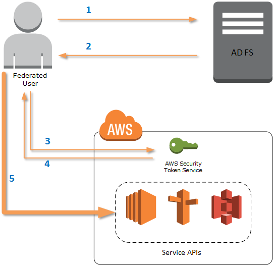
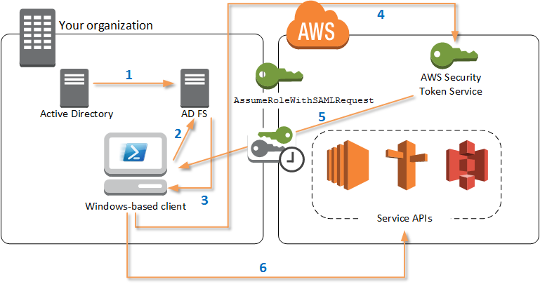

.. _saml-pst:

#################################################
Configuring Federated Identity with the |TWPlong|
#################################################

To let users in your organization access AWS resources, you must configure a standard and repeatable
authentication method for purposes of security, auditability, compliance, and the capability to
support role and account separation. Although it's common to provide users with the ability to
access AWS APIs, without federated API access, you would also have to create |IAMlong| (IAM) users,
which defeats the purpose of using federation. This topic describes SAML (Security Assertion Markup
Language) support in the |TWPlong| that eases your federated access solution.

SAML support in the |TWP| lets you provide users federated API access. SAML is an XML-based,
open-standard format for transmitting user authentication and authorization data between services;
in particular, between an identity provider (such as `Active Directory Federation Services 
<http://technet.microsoft.com/library/bb897402.aspx>`_), and a service provider (such as AWS). For
more information about SAML and how it works, see `SAML
<https://en.wikipedia.org/wiki/Security_Assertion_Markup_Language>`_ on Wikipedia, or `SAML 
Technical Specifications <http://saml.xml.org/saml-specifications>`_ at the Organization for the
Advancement of Structured Information Standards (OASIS) website. SAML support in the |TWP| is
compatible with SAML 2.0.

.. contents:: **Topics**
    :local:
    :depth: 1

.. _saml-pst-prerequisites:

Prerequisites
=============

You must have the following in place before you try to use SAML support for the first time.

* A federated identity solution that is correctly integrated with your AWS account for console access 
  by using only your organizational credentials. For more information about how to do this 
  specifically for Active Directory Federation Services, see the blog post, :aws-blogs:`Enabling Federation
  to AWS Using Windows Active Directory, AD FS, and SAML 2.0
  <blogs/security/enabling-federation-to-aws-using-windows-active-directory-adfs-and-saml-2-0/>`. 
  Although the blog post covers AD FS 2.0, the steps are similar if you are running AD FS 3.0.

* Version 3.1.31.0 or newer of the |TWP|_ installed on your local workstation.

.. _saml-pst-federated-process:

How an Identity-Federated User Gets Federated Access to AWS Service APIs
========================================================================

The following process describes, at a high level, how an Active Directory (AD) user is federated by
AD FS to gain access to AWS resources.

1. The federated user authenticates against AD FS.

2. If authentication is successful, the user is sent a SAML assertion.

3. The SAML assertion is sent to the |STSlong| (STS) in the form of a SAML request.

4. If the SAML request is valid, STS returns a SAML response that contains the user's AWS temporary
   credentials.

5. The AWS temporary credentials can be used to work with AWS service APIs by using tools including the
   |TWP|.

.. _saml-pst-overview:

How SAML Support Works in the |TWP|
===================================

This section describes how |TWP| cmdlets enable configuration of SAML-based identity federation for
users.

1. The |TWP| authenticate against AD FS by using the Windows user's current credentials, or
   interactively, when a cmdlet that requires credentials to call into AWS is run.

2. AD FS authenticates the user.

3. AD FS generates a SAML 2.0 authentication response that includes an assertion; the purpose of the
   assertion is to identify and provide information about the user. The PowerShell cmdlet extracts
   the list of the user's authorized roles from the SAML assertion.

4. The PowerShell cmdlet forwards the SAML request, including the requested role Amazon Resource Names
   (ARN), to STS by making the :code:`AssumeRoleWithSAMLRequest` API call.

5. If the SAML request is valid, STS returns a response that contains the AWS :code:`AccessKeyId`,
   :code:`SecretAccessKey`, and :code:`SessionToken`. These credentials last for 3,600 seconds (1 
   hour).

6. The |TWP| user now has valid credentials to work with any AWS service APIs that the user's role is
   authorized to access. The |TWP| automatically apply these credentials for any subsequent AWS API
   calls, and renew them automatically when they expire.

   .. note:: When the credentials expire, and new credentials are required, the |TWP| automatically
      reauthenticate with AD FS, and obtain new credentials for a subsequent hour. For users of
      domain-joined accounts, this process occurs silently. For accounts that are not
      domain-joined, users are prompted to enter their credentials before they can reauthenticate.

.. _saml-pst-config-cmdlets:

How to Use the PowerShell SAML Configuration Cmdlets
====================================================

The |TWP| include two new cmdlets that provide SAML support.

* :code:`Set-AWSSamlEndpoint` configures your AD FS endpoint, assigns a friendly name to the endpoint,
  and optionally describes the authentication type of the endpoint.

* :code:`Set-AWSSamlRoleProfile` creates or edits a user account profile that you want to associate
  with an AD FS endpoint, identified by specifying the friendly name you provided to the
  :code:`Set-AWSSamlEndpoint` cmdlet. Each role profile maps to a single role that a user is
  authorized to perform.

  Just as with AWS credential profiles, you assign a friendly name to the role profile. You can
  use the same friendly name with the :code:`Set-AWSCredential` cmdlet, or as the value of the
  :code:`-ProfileName` parameter for any cmdlet that invokes AWS service APIs.

Open a new |TWP| session. If you are running PowerShell 3.0 or newer, the |TWP| module is
automatically imported when you run any of its cmdlets. If you are running PowerShell 2.0, you must
import the module manually. To do this, run the Import-Module cmdlet, as shown in the following
example.

.. code-block:: none

    PS C:\> Import-Module "C:\Program Files (x86)\AWS Tools\PowerShell\AWSPowerShell\AWSPowerShell.psd1"

How to Run the :code:`Set-AWSSamlEndpoint` and :code:`Set-AWSSamlRoleProfile` Cmdlets
-------------------------------------------------------------------------------------

1. First, configure the endpoint settings for the AD FS system. The simplest way to do this is to store
   the endpoint in a variable, as shown in this step. Be sure to replace the placeholder account
   IDs and AD FS host name with your own account IDs and AD FS host name. Specify the AD FS host
   name in the :code:`Endpoint` parameter.

  .. code-block:: none

     PS C:\> $endpoint = "https://adfs.example.com/adfs/ls/IdpInitiatedSignOn.aspx?loginToRp=urn:amazon:webservices"

2. To create the endpoint settings, run the :code:`Set-AWSSamlEndpoint` cmdlet, specifying the correct
   value for the :code:`AuthenticationType` parameter. Valid values include :code:`Basic`,
   :code:`Digest`, :code:`Kerberos`, :code:`Negotiate`, and :code:`NTLM`. If you do not specify
   this parameter, the default value is :code:`Kerberos`.

   .. code-block:: none

      PS C:\> $epName = Set-AWSSamlEndpoint -Endpoint $endpoint -StoreAs ADFS-Demo -AuthenticationType NTLM

   The cmdlet returns the friendly name you assigned by using the :code:`-StoreAs` parameter, so
   you can use it when you run :code:`Set-AWSSamlRoleProfile` in the next line.

3. Now, you run the :code:`Set-AWSSamlRoleProfile` cmdlet to authenticate with the AD FS identity
   provider and get the set of roles (in the SAML assertion) that the user is authorized to
   perform.

   The :code:`Set-AWSSamlRoleProfile` cmdlet uses the returned set of roles to either prompt the
   user to select a role to associate with the specified profile, or validate that role data
   provided in parameters is present (if not, the user is prompted to choose). If the user is
   authorized for only one role, the cmdlet associates the role with the profile automatically,
   without prompting the user. There is no need to provide a credential to set up a profile for
   domain-joined usage.

   .. code-block:: none

      PS C:\> Set-AWSSamlRoleProfile -StoreAs SAMLDemoProfile -EndpointName $epName

   Alternatively, for non-domain-joined accounts, you can provide Active Directory credentials, and
   then select an AWS role to which the user has access, as shown in the following line. This is
   useful if you have different Active Directory user accounts to differentiate roles within your
   organization (for example, administration functions).

   .. code-block:: none
   
      PS C:\> $credential = Get-Credential -Message "Enter the domain credentials for the endpoint"
      Set-AWSSamlRoleProfile -EndpointName $epName -NetworkCredential $credential -StoreAs SAMLDemoProfile

4. In either case, the :code:`Set-AWSSamlRoleProfile` cmdlet prompts you to choose which role should be
   stored in the profile. The following example uses the :code:`ADFS-Dev` role.

   .. code-block:: none

      Select Role
      Select the role to be assumed when this profile is active
      [1] 1 - ADFS-Dev  [2] 2 - ADFS-Production  [?] Help (default is "1"): 1

   You can also specify a role without waiting for the prompt, by entering the :code:`RoleARN`,
   :code:`PrincipalARN`, and optional :code:`NetworkCredential` parameters (provided the role
   exists in the assertion returned by authentication. If it does not exist, the user is prompted
   to choose from available roles.)

   .. code-block:: none
   
      PS C:\> $params = @{ "NetworkCredential"=$credential, "PrincipalARN"="{arn:aws:iam::012345678912:saml-provider/ADFS}", "RoleARN"="{arn:aws:iam::012345678912:role/ADFS-Dev}"
      }
      PS C:\> $epName | Set-AWSSamlRoleProfile @params -StoreAs SAMLDemoProfile1 -Verbose

5. You can create profiles for all roles in a single command by adding the :code:`StoreAllRoles`
   parameter, as shown in the following code. Note that the role name is used as the profile name.

   .. code-block:: none
   
      PS C:\> Set-AWSSamlRoleProfile -EndpointName $epName -StoreAllRoles
      ADFS-Dev
      ADFS-Production

How to Use Role Profiles to Run Cmdlets that Require AWS Credentials
--------------------------------------------------------------------

To run cmdlets that require AWS credentials, you can use role profiles. Provide the name of a role
profile to :code:`Set-AWSCredential` (or as the value for any :code:`ProfileName` parameter in the
|TWP|) to get temporary AWS credentials automatically for the role that is described in the profile.

Although you use only one role profile at a time, you can switch between profiles within a shell
session. The :code:`Set-AWSCredential` cmdlet does not authenticate and get credentials when you
run it by itself; the cmdlet records that you want to use a specified role profile. Until you run a
cmdlet that requires AWS credentials, no authentication or request for credentials occurs.

You can now use the temporary AWS credentials that you obtained with the :code:`SAMLDemoProfile`
profile to work with AWS service APIs. The following sections show examples of how to use role
profiles.

Example 1: Set a Default Role with :code:`Set-AWSCredential`
-------------------------------------------------------------

This example sets a default role for a |TWP| session by using :code:`Set-AWSCredential`. Then, you
can run cmdlets that require credentials, and are authorized by the specified role. This example
lists all |EC2long| instances in the |uswest2-name| that are associated with the profile you
specified with the :code:`Set-AWSCredential` cmdlet.

.. code-block:: none

    PS C:\> Set-AWSCredential -ProfileName SAMLDemoProfile
    PS C:\> Get-EC2Instance -Region us-west-2 | Format-Table -Property Instances,GroupNames
    
    Instances                                                   GroupNames
    ---------                                                   ----------
    {TestInstance1}                                             {default}
    {TestInstance2}                                             {}
    {TestInstance3}                                             {launch-wizard-6}
    {TestInstance4}                                             {default}
    {TestInstance5}                                             {}
    {TestInstance6}                                             {AWS-OpsWorks-Default-Server}

Example 2: Change Role Profiles During a PowerShell Session
-----------------------------------------------------------

This example lists all available |S3long| buckets in the AWS account of the role associated with the
:code:`SAMLDemoProfile` profile. The example shows that although you might have been using another
profile earlier in your |TWP| session, you can change profiles by specifying a different value for
the :code:`-ProfileName` parameter with cmdlets that support it. This is a common task for
administrators who manage |S3| from the PowerShell command line.

.. code-block:: none

    PS C:\> Get-S3Bucket -ProfileName SAMLDemoProfile
     
    CreationDate                                                BucketName
    ------------                                                ----------
    7/25/2013 3:16:56 AM                                        mybucket1
    4/15/2015 12:46:50 AM                                       mybucket2
    4/15/2015 6:15:53 AM                                        mybucket3
    1/12/2015 11:20:16 PM                                       mybucket4

Note that the :code:`Get-S3Bucket` cmdlet specifies the name of the profile created by running the
:code:`Set-AWSSamlRoleProfile` cmdlet. This command could be useful if you had set a role profile
earlier in your session (for example, by running the :code:`Set-AWSCredential` cmdlet) and wanted
to use a different role profile for the :code:`Get-S3Bucket` cmdlet. The profile manager makes
temporary credentials available to the :code:`Get-S3Bucket` cmdlet.

Though the credentials expire after 1 hour (a limit enforced by STS), the |TWP| automatically
refresh the credentials by requesting a new SAML assertion when the tools detect that the current
credentials have expired.

For domain-joined users, this process occurs without interruption, because the current user's
Windows identity is used during authentication. For non-domain-joined user accounts, the |TWP| show
a PowerShell credential prompt requesting the user password. The user provides credentials that are
used to reauthenticate the user and get a new assertion.

Example 3: Get Instances in a Region
------------------------------------

The following example lists all |EC2| instances in the |apsoutheast2-name| that are associated with
the :code:`ADFS-Production` profile. This is a useful command for returning all |EC2| instances in a
region.

.. code-block:: none

    PS C:\> (Get-Ec2Instance -ProfileName ADFS-Production -Region ap-southeast-2).Instances | Select InstanceType, @{Name="Servername";Expression={$_.tags | where key -eq "Name" | Select Value -Expand Value}}
    
     InstanceType                                                Servername
     ------------                                                ----------
     t2.small                                                    DC2
     t1.micro                                                    NAT1
     t1.micro                                                    RDGW1
     t1.micro                                                    RDGW2
     t1.micro                                                    NAT2
     t2.small                                                    DC1
     t2.micro                                                    BUILD

.. _saml-pst-reading:

Additional Reading
==================

For general information about how to implement federated API access, see :aws-blogs:`How to Implement a General
Solution for Federated API/CLI Access Using SAML 2.0 
<blogs/security/how-to-implement-a-general-solution-for-federated-apicli-access-using-saml-2-0/>`.

For questions or comments, be sure to visit the AWS Developer Forums for 
:forum:`PowerShell Scripting <149>` or :forum:`.NET Development <61>`.

